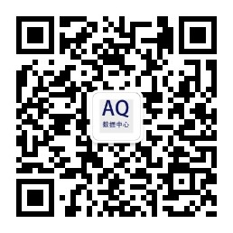

## 我的个人网站

[aliuge0608知识分享](http://www.qinyadan.com)

## 擅长
## 语言特长
```text
    1. java基础
       1.1 gc jvm特性
       1.2 框架、架构
       1.3 中间件、平台
    2. go语言
    3. Rust进阶
```

## 项目经验
1. O2O和电商项目
2. 金融P2P平台
3. 在线教育
4. 餐饮SAAS平台


## 关注我的公众号
```
微信搜索: AQ数据共享平台
```

